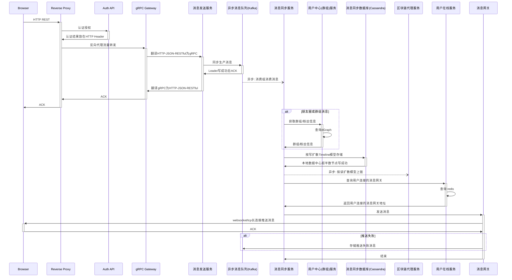
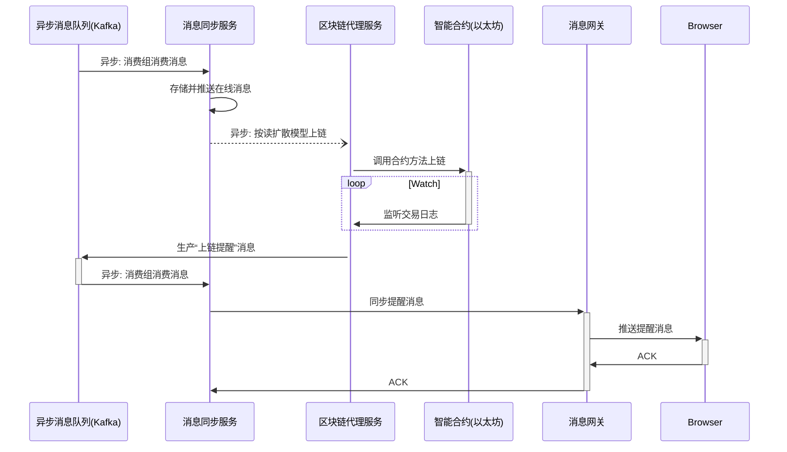
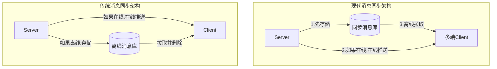

```mermaid
sequenceDiagram
    %% 注释
    Browser ->>+ Reverse Proxy: HTTP REST
    Reverse Proxy ->>+ Auth API: 认证授权
    Auth API ->>- Reverse Proxy: 认证结果放在HTTP Header
    Reverse Proxy ->>+ gRPC Gateway: 反向代理流量转发
    gRPC Gateway ->>+ 消息发送服务: 翻译HTTP-JSON-RESTful为gRPC
    消息发送服务 ->>+ 异步消息队列(Kafka): 同步生产消息
    异步消息队列(Kafka) ->>- 消息发送服务: Leader写成功后ACK
    异步消息队列(Kafka) --) 消息同步服务: 异步: 消费组消费消息
    消息发送服务 ->>- gRPC Gateway: 翻译gRPC为HTTP-JSON-RESTful
    gRPC Gateway ->>- Reverse Proxy: ACK
    Reverse Proxy ->>- Browser: ACK
    alt 朋友圈或群组消息
    消息同步服务 ->>+ 用户中心(群组)服务: 获取群组/粉丝信息
    用户中心(群组)服务 ->> 用户中心(群组)服务: 查询dGraph
    用户中心(群组)服务 ->>- 消息同步服务: 群组/粉丝信息
    end
    消息同步服务 ->>+ 消息同步数据库(Cassandra): 按写扩散Timeline模型存储
    消息同步数据库(Cassandra) ->>- 消息同步服务: 本地数据中心超半数节点写成功
    消息同步服务 --) 区块链代理服务: 异步: 按读扩散模型上链
    消息同步服务 ->>+ 用户在线服务: 查询用户连接的消息网关
    用户在线服务 ->> 用户在线服务: 查询 redis
    用户在线服务 ->>- 消息同步服务: 返回用户连接的消息网关地址
    消息同步服务 ->>+ 消息网关: 发送消息
    消息网关 ->>+ Browser: websocket/tcp长连接推送消息
    Browser ->>- 消息网关: ACK
    alt 推送失败
    消息网关 ->> 异步消息队列(Kafka): 存储推送失败消息
    end
    消息网关 ->>- 消息同步服务: 结束

```

```mermaid
sequenceDiagram
  异步消息队列(Kafka) ->> 消息同步服务: 异步: 消费组消费消息
  消息同步服务 ->> 消息同步服务: 存储并推送在线消息
  消息同步服务 --)+ 区块链代理服务: 异步: 按读扩散模型上链
  区块链代理服务 ->>+ 智能合约(以太坊): 调用合约方法上链
  loop  Watch
    智能合约(以太坊) ->>- 区块链代理服务: 监听交易日志
  end
  区块链代理服务 ->>+ 异步消息队列(Kafka): 生产“上链提醒”消息
  异步消息队列(Kafka) ->>- 消息同步服务: 异步: 消费组消费消息
  消息同步服务 ->>+ 消息网关: 同步提醒消息
  消息网关 ->>+ Browser: 推送提醒消息
  Browser ->>- 消息网关: ACK
  消息网关 ->>- 消息同步服务: ACK
```

```mermaid
flowchart 
subgraph 现代消息同步架构
Server2[Server]-->|1.先存储| syncdb2[(同步消息库)] -->|3.离线拉取| Client2[多端Client]
Server2-->|2.如果在线,在线推送| Client2
end

subgraph 传统消息同步架构
Server -->|如果在线,在线推送| Client
Server -->|如果离线,存储| syncdb[(离线消息库)] -->|拉取并删除| Client
end


```